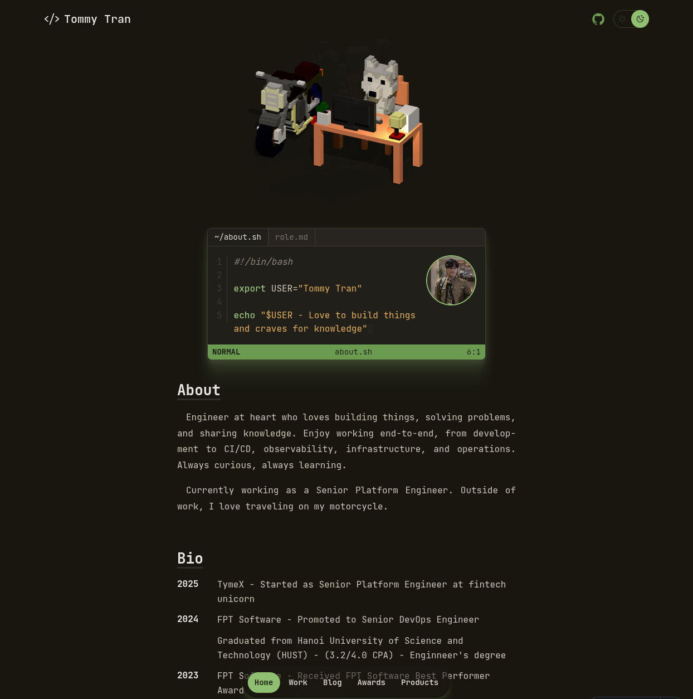

# Tommy Tran's Portfolio

My personal portfolio at [craftaholic.sh](https://craftaholic.sh), built with Astro 5 and Three.js.

Feel free to use this as a template for your own portfolio!




## Features

- **Interactive 3D Model** - Three.js powered voxel model with touch/mouse controls
- **Vim-Inspired Design** - Terminal aesthetic with syntax highlighting
- **9 Color Themes** - Tokyo Night, Nord, Gruvbox, Cyberpunk, and more
- **Blog with Search** - Full-text search, tags, reading progress bar
- **SEO Optimized** - Open Graph, Twitter Cards, JSON-LD, sitemap
- **Mobile First** - Responsive design with bottom navigation on mobile
- **Fast** - Static site generation, optimized assets, Cloudflare Pages ready
- **Comments** - Giscus integration for blog discussions
- **Development Journal** - Track your product development journey with detailed entries

## Quick Start

```bash
# Clone and setup
git clone https://github.com/craftaholic/portfolio.git my-portfolio
cd my-portfolio

# Install and run
bun install
bun dev
```

Open [http://localhost:4321](http://localhost:4321) in your browser.

## Commands

```bash
bun dev          # Start dev server
bun build        # Build for production
bun preview      # Preview production build
bun run deploy   # Deploy to Cloudflare Pages
```

---

## Using as a Template

### 1. Update Site Configuration

Edit `src/config.ts`:

```typescript
export const SITE = {
  website: 'https://yourdomain.com',
  author: 'Your Name',
  title: 'Your Name',
  description: 'Your professional tagline',
  terminalUser: 'yourname',
  socialLinks: [
    { href: 'https://github.com/you', label: 'GitHub', icon: 'github-logo' },
    { href: 'https://linkedin.com/in/you', label: 'LinkedIn', icon: 'linkedin-logo' },
  ],
} as const;

export const NAV_LINKS = [
  { label: 'Home', href: '/' },
  { label: 'Work', href: '/work/' },
  { label: 'Blog', href: '/blog/' },
] as const;
```

### 2. Replace Assets

```
public/
├── assets/images/profile.webp   # Your photo (400x400px min)
├── assets/model/voxel_3d.glb    # Your 3D model (optional)
├── favicon.svg                   # Your favicon
├── og-image.png                  # Social sharing image (1200x630px)
└── apple-touch-icon.png          # iOS icon (180x180px)
```

### 3. Add Your Content

**Blog posts** - `src/content/blog/my-post.md`:

```markdown
---
title: My First Post
pubDatetime: 2024-01-15T00:00:00Z
description: A brief description
tags: [tutorial, javascript]
---

Your content here...
```

**Work experience** - `src/content/work/project.md`:

```markdown
---
title: Project Name
description: What you did
publishDate: 2024-01-01
tags: [TypeScript, React]
role: Senior Engineer
company: Company Name
duration: Jan 2024 - Present
---

Project details...
```

**Products** - `src/content/products/my-project.md`:

```markdown
---
title: My Project
description: A tool that does X
publishDate: 2024-01-01
tags: [Go, Docker]
github: https://github.com/you/project
status: mature
opensource: true
pinned: false
icon: "🚀"
features:
  - "Feature one description"
  - "Feature two description"
---

About the project...
```

**Development journals** - `src/content/journals/{product-slug}/{date}.md`:

```markdown
---
title: Working on new feature
date: 2024-03-15
overview: Short summary shown in the journal list.
---

Detailed journal entry about your development progress...
```

Journals are automatically linked to products via the directory name (e.g., `journals/my-project/` links to `products/my-project.md`).

### 4. Customize Theme

Change theme in `src/styles/global.css`:

```css
@import './themes/tokyo-night.css';   /* or: nord, gruvbox, cyberpunk-muted, etc. */
```

### 5. Setup Comments (Optional)

1. Enable GitHub Discussions on your repo
2. Install [Giscus app](https://github.com/apps/giscus)
3. Get config from [giscus.app](https://giscus.app/)
4. Update `src/config.ts`:

```typescript
export const GISCUS = {
  repo: 'you/yourrepo',
  repoId: 'R_xxx',
  category: 'Blog Comments',
  categoryId: 'DIC_xxx',
} as const;
```

## Deployment

### Cloudflare Pages (Recommended)

1. Push to GitHub
2. Connect repo at [Cloudflare Pages](https://pages.cloudflare.com/)
3. Set build command: `bun run build`, output: `dist`

### Other Platforms

```bash
# Vercel
bunx vercel

# Netlify
bun run build && bunx netlify deploy --prod --dir=dist
```

## Project Structure

```
src/
├── components/
│   ├── blog/        # Comments, search, TOC
│   ├── layout/      # Nav, footer, containers
│   ├── sections/    # Hero, timeline, bio
│   ├── three/       # 3D model
│   └── ui/          # Icons, pills, buttons
├── content/
│   ├── blog/        # Blog posts (markdown)
│   ├── journals/    # Development journals (markdown)
│   ├── products/    # Products (markdown)
│   └── work/        # Work experience (markdown)
├── pages/           # Routes
├── styles/themes/   # Color themes
├── config.ts        # Site configuration
└── content.config.ts
```

## Removing Features

```bash
# Remove comments
rm src/components/blog/Comments.astro
```

## Credits

- Design inspired by [craftz.dog](https://www.craftz.dog/)
- Built with [Astro](https://astro.build/)
- 3D rendering with [Three.js](https://threejs.org/)
- Icons from [Phosphor Icons](https://phosphoricons.com/)

## License

MIT License - feel free to use this for your own portfolio!
